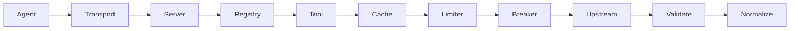

# Architecture

Agents call tools through stdio or Streamable HTTP. Each tool validates input, checks cache, rate-limits upstream calls, validates upstream JSON (drift detection), then normalizes output.
