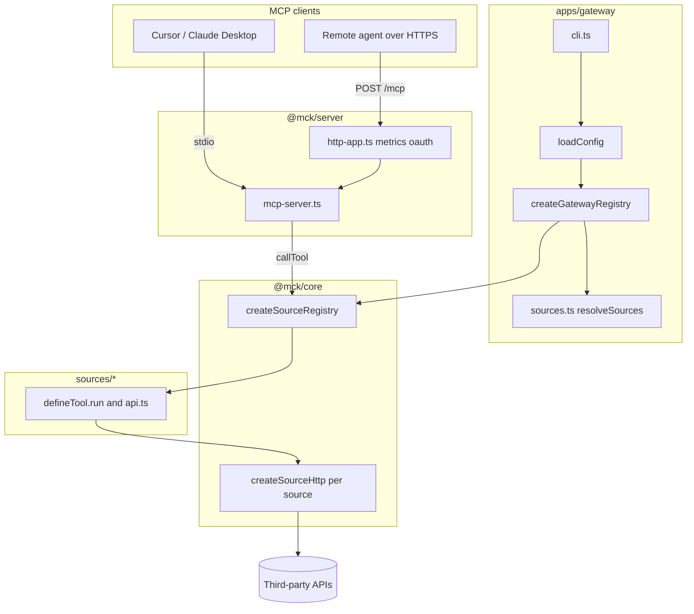

# Architecture

Agents talk to one process: the **gateway** (`apps/gateway`, npm `@mck/gateway`). That process loads a fixed set of **sources** (`sources/*`, npm `@mck/source-*`), each exporting MCP tools built with **defineTool** / **defineSource** from `@mck/core`. Production code reaches the MCP SDK only through **`@mck/server`** (gateway e2e tests import the SDK client for harnesses).

Shared libraries: **`@mck/core`** (registry, HTTP, cache, validation), **`@mck/server`** (stdio + Streamable HTTP, metrics, OAuth), **`@mck/testing`** (contract replay), **`@mck/cli`** (`mck new`, `mck check`, `mck record`).

**Startup:** `cli.ts` → `loadConfig()` in `config.ts` (source ids from `profiles.ts` and SKU filter in `tier.ts`) → `createGatewayRegistry()` in `index.ts` → `resolveSources()` in `sources.ts` → `createSourceRegistry()` with shared cache, Prometheus metrics, and logging.

**Tool call order inside `createSourceRegistry.callTool`:** resolve tool by name → trace span → validate input (Zod) → read cache (optional; single-flight on miss) → `tool.run()` (handlers in `api.ts` use `ctx.http`: allowlisted hosts, limiter, retry, breaker; upstream JSON checked with `validateUpstream` where applicable) → validate output (Zod) → metrics, structured logs, optional audit, per-source health.

**Offline quality gate:** each source keeps `fixtures/*.contract.json`; `@mck/testing` replays them with undici mocks. CI runs `pnpm check`, `pnpm validate:registry`, and `pnpm mck check .`.

For a full file-by-file tour, see [codebase-walkthrough.md](./codebase-walkthrough.md).
