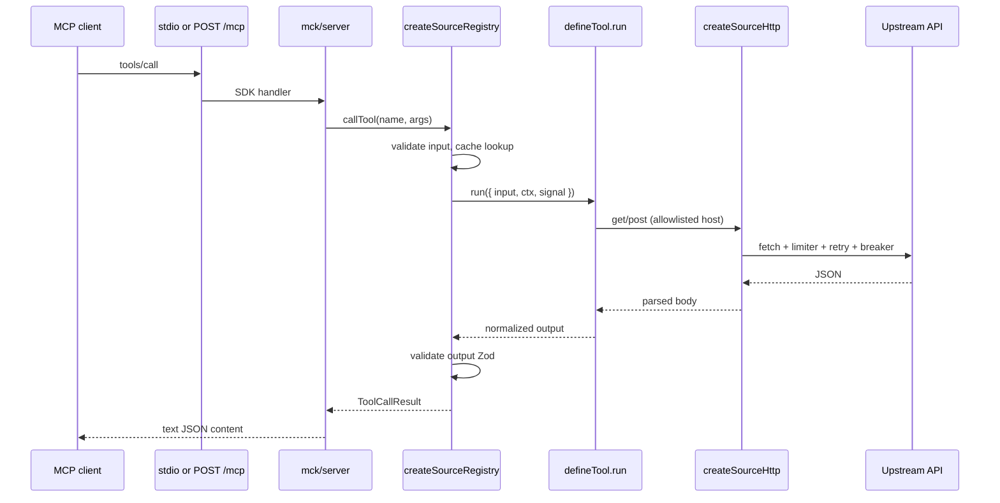

# Codebase walkthrough

This is a file-by-file map of **mcp-connector-kit**: how an MCP client reaches upstream APIs, where contracts live, and which folders you touch for a new connector. For deployment and SKUs, see [hosted-gateway.md](./hosted-gateway.md) and [trust-tier.md](./trust-tier.md).

The repo is a **pnpm + Turborepo** monorepo. Workspaces are declared in `pnpm-workspace.yaml` (`packages/*`, `sources/*`, `apps/*`). `turbo.json` runs `build` with upstream dependencies, then `test` after build.

---

## Request path (one tool call)



At runtime nothing “discovers” sources dynamically. The gateway **imports** each `@mck/source-*` package and picks ids from env (`MCK_SOURCE_PROFILE`, `MCK_SOURCES`, `MCK_SKU`).

---

## Repository root

| File | Role |
|------|------|
| `package.json` | Root scripts: `pnpm check` (build + test), `pnpm validate:registry`, `pnpm mck` → CLI dist. |
| `pnpm-workspace.yaml` | Workspace globs. |
| `turbo.json` | Task graph for CI and local runs. |
| `tsconfig.base.json` | Shared TS options for packages. |
| `.env.example` | Documented env vars for gateway and API keys. |
| `Dockerfile` | Multi-stage build of `@mck/gateway`; default HTTP, `default` profile, `free` SKU. |
| `packages/catalog` | Shared source catalog JSON: tiers, tools, demo presets, profiles. Gateway SKU filter, `validate-registry.mjs`, and `apps/web` all consume it. |
| `scripts/validate-registry.mjs` | Ensures `registry/sources/*.json` matches `sources/<id>`, catalog ids, and `pnpm catalog:generate` output. |
| `.github/workflows/ci.yml` | `pnpm check`, `pnpm validate:registry`, `pnpm mck check .`. |
| `.github/workflows/sbom.yml` | SBOM artifact on `main`. |
| `.github/workflows/live-contracts.yml` | Scheduled health smoke; optional manual upstream curl. |
| `.github/workflows/release.yml` | npm publish when `NPM_TOKEN` is set. |
| `ops/grafana/mck-gateway-dashboard.json` | Grafana import for gateway metrics. |
| `ops/prometheus/mck-alerts.yml` | Example Prometheus alert rules. |
| `registry/server.json` | Public gateway metadata for MCP registry consumers. |
| `registry/sources/*.json` | Per-source registry entries (`id`, `package`, trust metadata). |
| `registry/README.md` | How registry JSON relates to npm packages. |

Every shipped connector under `sources/` must appear in `apps/gateway/src/sources.ts` and `registry/sources/<id>.json`. Scaffolding via `pnpm mck new source` does not enable a source until you wire those two places (and SKU/profile lists when it joins the trust tier).

---

## `apps/gateway` — deployable multi-source server

This is what you run in Docker or on Railway. It loads env, builds a `SourceRegistry`, then hands that registry to `@mck/server`.

### `src/cli.ts`

Entry point. Reads config, builds the registry, then either:

- **stdio** — `createMcpServer` + `connectStdio` (local Cursor/Claude Desktop style), or  
- **http** — `startHttpApp` on `PORT` with optional API keys and OAuth JWKS.

Also calls `initOtelIfConfigured()` when OTEL env is present.

### `src/index.ts`

`createGatewayRegistry(config)` is the composition root:

1. Memory or Redis cache from `MCK_CACHE` / `REDIS_URL`.
2. `resolveSources` for the enabled source ids.
3. `scaleSourceLimits` when `MCK_SKU=paid` (2× rps/burst/concurrency).
4. `createSourceRegistry` with Prometheus metrics, pino logging, optional audit fields.

`createGatewayFromEnv()` is the env-only wrapper tests and CLI use.

### `src/config.ts`

Single Zod parse of process env at boot. Important derived fields:

- `sourceIds` — from `MCK_SOURCE_PROFILE` **or** comma list `MCK_SOURCES`, then filtered by SKU.
- `apiKeys`, `corsOrigins`, `webReaderAllowlist` — parsed lists.
- OAuth: `MCK_OAUTH_JWKS_URL`, `MCK_OAUTH_AUDIENCE`.

Misconfiguration throws here instead of halfway through a tool call.

### `src/profiles.ts`

Named bundles:

- `default` → free list from `@mck/catalog` (`FREE_TIER_SOURCE_IDS`)
- `trust` → full catalog (`TRUST_TIER_SOURCE_IDS`)
- `research` → wikipedia, openalex, openlibrary
- `geo` → open-meteo, usgs, worldbank
- `daily` → frankfurter, hn, open-meteo

If `MCK_SOURCE_PROFILE` is set, it wins over `MCK_SOURCES`.

### `src/tier.ts`

Hosted product logic. Source id lists are imported from `@mck/catalog` (see `packages/catalog/src/data.json`):

- `free` SKU keeps `FREE_TIER_SOURCES` and drops keyed connectors.
- `paid` SKU allows the full trust list.
- `limitMultiplierForSku` doubles limits on paid.

Exported `TRUST_TIER_SOURCES` matches docs and registry validation.

### `src/sources.ts`

Static **catalog** mapping string id → `SourceDefinition`. This is the allowlist of packages the gateway can load. Unknown ids in env throw at startup.

`web-reader` is special: factory takes allowlist from config so SSRF policy is deployment-specific.

### `src/otel.ts`

Optional OpenTelemetry bootstrap when exporters are configured.

### Tests

| File | What it proves |
|------|----------------|
| `gateway-stdio.e2e.test.ts` | MCP over stdio lists tools and calls fixture echo. |
| `gateway-http.e2e.test.ts` | Streamable HTTP `/mcp` with mocked network. |
| `gateway-trust.e2e.test.ts` | Trust profile tool surface and SKU filtering. |
| `tier.test.ts`, `gateway.test.ts` | Unit coverage for tier and registry wiring. |

### Build

`tsup.config.ts` bundles `cli.ts` to `dist/cli.js`. `package.json` depends on every `@mck/source-*` used in the catalog plus `@mck/server` and `@mck/core`.

---

## `packages/core` — shared connector runtime

Everything a source author needs without importing the MCP SDK.

### `src/contract/define.ts`

- `defineTool` — one MCP tool: Zod input/upstream/output schemas + `run()`.
- `defineSource` — id, title, `baseUrls`, rate limits, cache defaults, tool list, optional `health` probe.

Tools stay read-only by convention; enforcement is at the MCP layer (`readOnlyHint` in server).

### `src/contract/types.ts`

TypeScript shapes for `SourceDefinition`, `ToolContext`, `ToolCallResult`, metrics hooks.

### `src/contract/validate.ts`

Turns Zod failures into `ConnectorError` with stable codes (`invalid_input`, `upstream_schema_changed`, etc.).

### `src/contract/registry.ts`

**Heart of the framework.** `createSourceRegistry`:

1. Registers each tool under `sourceId.toolName` and optionally bare `toolName` when `legacyToolNames` is true.
2. Injects a synthetic `health` tool per source if missing.
3. Builds one `ToolContext` per source with a dedicated `createSourceHttp` client.
4. On `callTool`: span → validate input → cache (with single-flight) → `run` → validate output → metrics/audit/health state.

Export surface also includes `createDefaultCache` and `validateUpstream` for contract tests.

### `src/http/client.ts`

Per-source HTTP:

- Host must match `baseUrls` (SSRF guard).
- Token bucket RPS, concurrency semaphore, circuit breaker.
- Retries with backoff on retryable status codes.
- `get`, `post`, and `getUrl` (web-reader uses absolute URLs with the same allowlist rules).

### `src/http/limiter.ts`, `breaker.ts`, `retry.ts`

Policy primitives used by the client. Unit tests live beside each file.

### `src/cache/memory.ts`, `redis.ts`, `types.ts`

Pluggable cache; memory cache includes `singleFlight` to collapse duplicate in-flight keys.

### `src/errors.ts`

`ConnectorError` with codes clients and tests can rely on.

### `src/log/pino.ts`

Structured logger factory and adapter into `ToolContext.log`.

### `src/telemetry/spans.ts`

Thin wrapper for optional OTEL spans around tool calls.

### `src/text/html-text.ts`

HTML → plain text for web-reader normalization (replaces older locale-specific helpers).

### `src/index.ts`

Public API re-exports for `@mck/core`.

---

## `packages/server` — MCP transport and HTTP hosting

### `src/mcp-server.ts`

Wraps `@modelcontextprotocol/sdk` `McpServer`. Registers every name from `registry.listToolNames()` with Zod-derived JSON Schema (`zod-shape.ts`). Tool results are JSON text; errors respect `legacyErrors` formatting.

### `src/http-app.ts`

Node `http.Server`:

| Route | Purpose |
|-------|---------|
| `GET /healthz` | Liveness + SKU label |
| `GET /readyz` | Per-source health from registry |
| `GET /metrics` | Prometheus from shared registry |
| `GET /.well-known/oauth-protected-resource` | OAuth metadata when JWKS configured |
| `POST /mcp` | Streamable MCP; API key or JWT via `oauth.ts` |

CORS applied when `MCK_CORS_ORIGINS` is set.

### `src/oauth.ts`

JWKS fetch + JWT verification for protected MCP; optional audience check.

### `src/metrics.ts`

Prometheus counters/histograms; singleton registry so tests do not double-register.

### E2E entrypoints under `src/e2e/`

Small programs vitest spawns for stdio/http integration tests.

---

## `packages/testing` — contract replay and drift

### `src/fixtures.ts`

Load JSON fixture files from disk.

### `src/replay-contract.ts`

Given a `ToolContract` document, registers mock HTTP responses on undici `MockAgent`, runs the real tool through the registry, compares output.

### `src/describe-contract-replay.ts`

Vitest helper: for each `fixtures/*.contract.json`, one test that replays offline. Every source’s `src/contract.test.ts` calls this.

### `src/drift.ts`, `check-fixtures.ts`

Structural checks on contract files; used by `mck check`.

### `src/e2e-network.ts`

Test helper: allow localhost through MockAgent while blocking real network in CI.

### `src/mock-http.ts`

Build mock response blocks for fixtures (GET/POST bodies).

---

## `packages/cli` — `mck` command

### `src/cli.ts`

- `mck new source <name>` — scaffolds `sources/<name>` with package.json, tsup, sample tool, empty fixture dir.
- `mck check [root]` — walks repo for `*.contract.json` and validates structure + replay rules.
- `mck record <source> <tool> --input '...'` — live capture path (requires `MCK_LIVE=1`); writes fixture for you to add mocks.

### `src/record.ts`

Implementation of live recording.

### `src/registry.test.ts`

Runs `scripts/validate-registry.mjs` in CI.

---

## `sources/*` — one package per upstream

Each active trust-tier source follows the same layout:

```
sources/<id>/
  package.json          # @mck/source-<id>
  src/index.ts          # re-exports source
  src/source.ts         # defineSource + defineTool list
  src/api.ts            # HTTP calls via ctx.http, validateUpstream
  fixtures/*.contract.json
  src/contract.test.ts  # describeSourceContractReplay(...)
  tsup.config.ts
  vitest.config.ts
```

### Per-source notes

| Id | Tools (legacy names when enabled) | Upstream |
|----|-----------------------------------|----------|
| `fixture` | `echo` | No network; sanity check |
| `wikipedia` | `wiki_search`, `wiki_summary` | MediaWiki API |
| `open-meteo` | `weather_forecast` | Open-Meteo forecast + geocoding |
| `frankfurter` | `fx_latest` | Frankfurter `/v1/latest` |
| `openalex` | `paper_search` | OpenAlex works search |
| `openlibrary` | `book_search` | Open Library search |
| `hn` | `hn_search` | HN Algolia story search |
| `usgs` | `recent_quakes` | USGS significant-week GeoJSON |
| `worldbank` | `country_profile` | World Bank country API |
| `github` | `search_repositories`, `search_issues` | GitHub REST (token via env) |
| `web-reader` | `fetch_page` | Allowlisted HTTPS fetch + HTML text |
| `brave` | `web_search` | Brave Search API |
| `exa` | `exa_search` | Exa POST API |
| `tavily` | `tavily_search` | Tavily POST API |

Typical `api.ts` pattern: call `ctx.http.get` or `post`, parse JSON, run `validateUpstream` against the tool’s upstream schema, map to output shape. Contract JSON stores `input`, optional `mock` blocks, and expected `output` for CI.

Environment variables for keys are read inside each source’s `api.ts` or `source.ts` (see `.env.example`).

---

## Docs folder (operator and author)

| Doc | Audience |
|-----|----------|
| `architecture.md` | Short diagram + link here |
| `adding-a-source.md` | Author checklist |
| `trust-tier.md` | Which sources ship in paid tier |
| `hosted-gateway.md` | SKU and env for hosted |
| `oauth.md` | JWKS and protected resource metadata |
| `registry.md` / `npm-publish.md` | Publishing connectors |
| `operations.md` / `slo.md` / `production.md` | Runbooks and checklist |
| `supply-chain.md` / `railway.md` | SBOM and deploy |

---

## What to change for common tasks

**Add a connector**

1. `mck new source myapi` or copy an existing source folder.
2. Implement `source.ts` + `api.ts`, add `fixtures/my_tool.contract.json`.
3. Wire id in `apps/gateway/src/sources.ts` and `packages/catalog/src/data.json` (`tier: "free"` or `"paid"`). `tier.ts` reads the catalog; do not add a third copy of the id list.
4. Add `registry/sources/myapi.json` (title, tier, hosts), gateway `package.json` dependency, then `pnpm catalog:generate`.
5. `pnpm check`, `pnpm validate:registry`, `pnpm mck check .`.

**Ship hosted free tier**

Docker defaults: `MCK_SOURCE_PROFILE=default`, `MCK_SKU=free`, HTTP on 8080.

**Ship hosted paid tier**

Set `MCK_SOURCE_PROFILE=trust`, `MCK_SKU=paid`, API keys, web-reader allowlist, optional OAuth JWKS. Scale limits apply automatically.

**Debug a failing contract**

Open the source’s `fixtures/*.contract.json`, run that source’s vitest file, adjust mocks in the fixture or upstream schema in `defineTool`.

---

## Mental model

- **Source** = policy + tools + HTTP allowlist.  
- **Tool** = Zod in/out + one `run` function.  
- **Registry** = cache, metrics, validation, naming.  
- **Gateway** = which sources load in this process.  
- **Server** = how agents connect (stdio vs HTTP).  
- **Fixtures** = offline proof that tools still match recorded behavior.

That split is intentional: you can test `@mck/source-wikipedia` without running the gateway, and run the gateway without touching MCP SDK code in each source.
